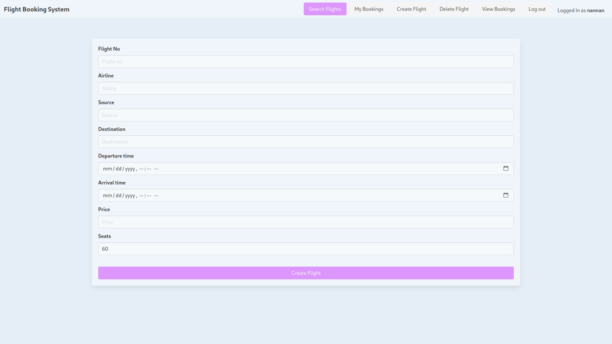
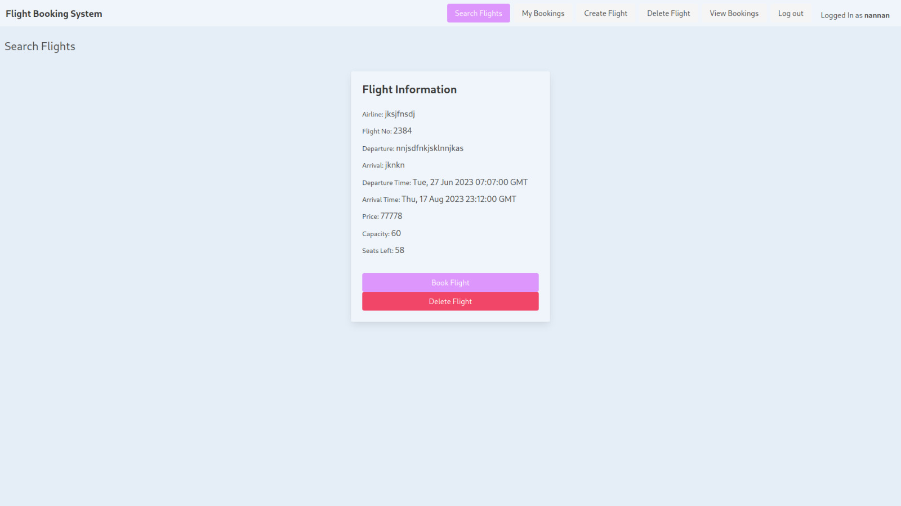
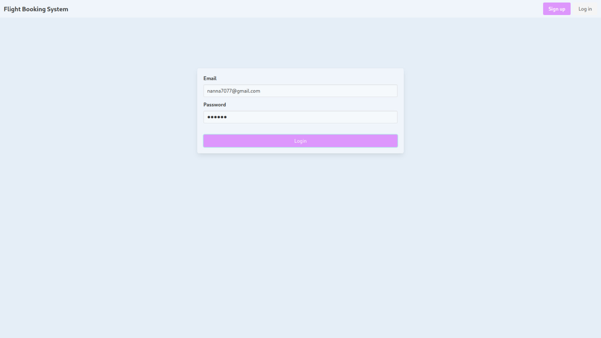
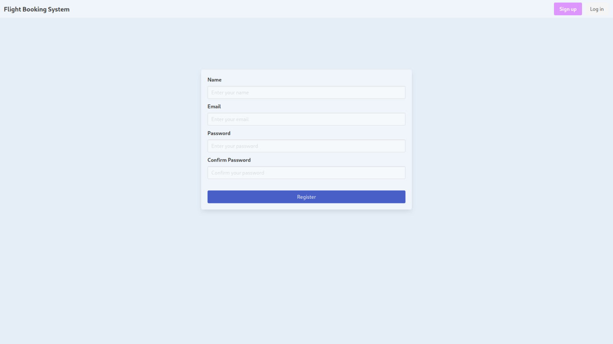
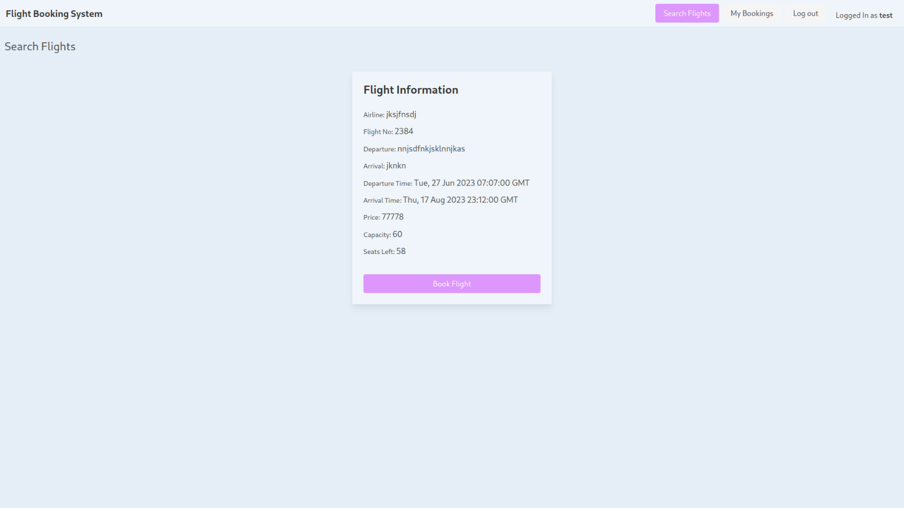
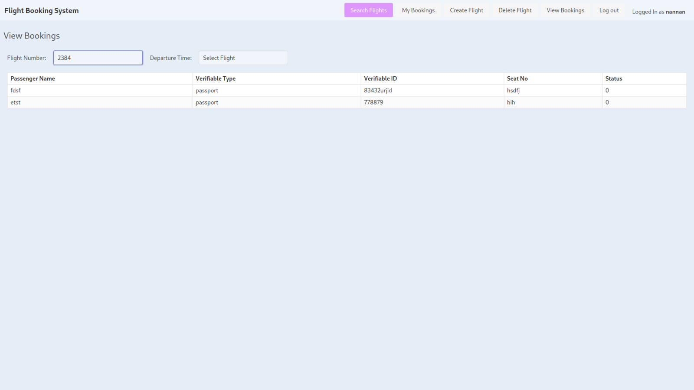

# Flight Ticket Booking System

ℹ️ To convert a user to admin, you can directly change their utype to 1 in the users table in the database. Or, alternatively, please use the following credentials to login as an admin:
```
email: nanna7077@gmail.com
password: nannan
```
You can create a regular user account via the UI itself.

## To run the backend

1. Change directory to backend
2. Install requirements using
```
pip install -r requirements.txt
```
3. Run the server using
```
python app.py
```
4. The server will be running on http://localhost:5000/

## To run the frontend

1. Change directory to frontend
2. Run the server using
```
python -m http.server
```
3. The server will be running on http://localhost:8000/

---

Please reach out to nanna7077@gmail.com for any queries or help with running the application.

---

## Screenshots

Create Flight


Show Flights


Login


Register


Search Flight


View Bookings
